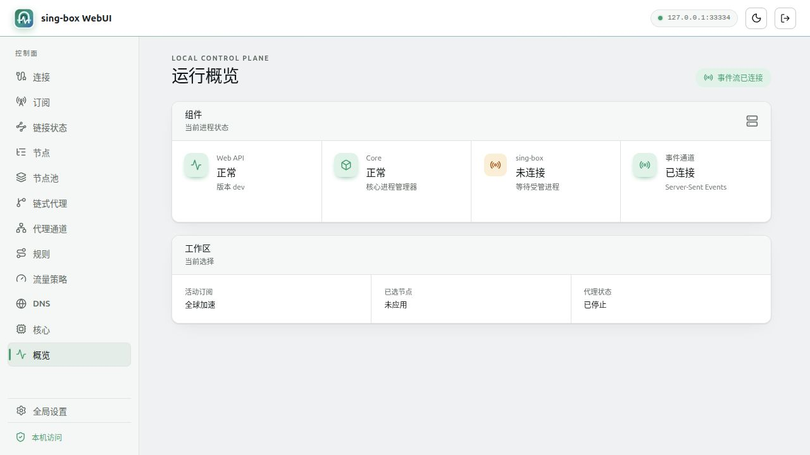
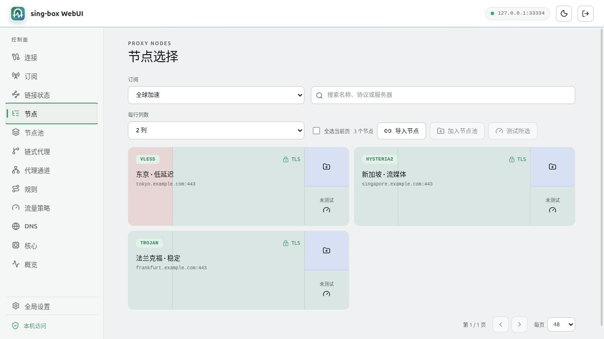
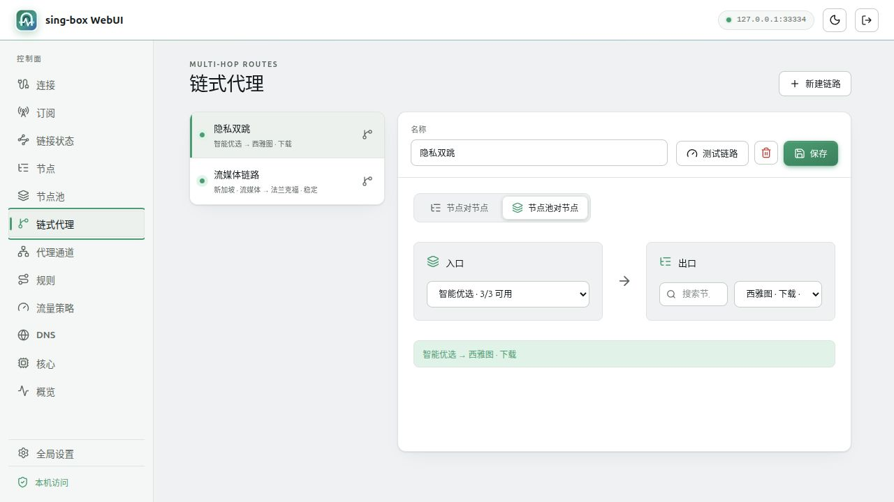
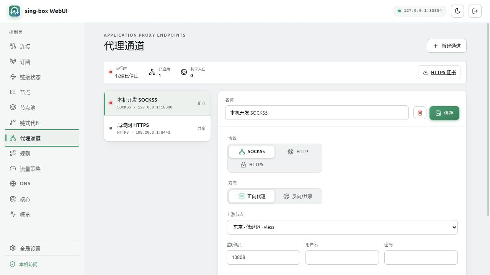

# sing-box WebUI

面向 Linux 客户端场景的本地 sing-box 控制面。项目使用系统浏览器作为界面，
不提供桌面 GUI；后端负责本地 API、配置事务和 sing-box 生命周期管理。

社区：[Linux.do](https://linux.do/) — 一个友好的中文技术社区。

## 已实现功能

- **订阅与节点管理**：支持订阅拉取、自动更新、手动节点导入、节点搜索与排序，
  并通过真实 sing-box 出站进行批量延迟测试。
- **连接与热切换**：可选择单节点、节点池或链式代理作为运行目标，支持系统代理与
  Linux TUN 模式；运行目录有效时可热切换根 selector，减少现有连接中断。
- **节点池与健康管理**：提供多目标探测、故障隔离、指数退避、恢复检测、空闲感知
  和切换容差，节点全部失效时不会回退到直连。
- **链式代理**：支持节点到节点、节点池到节点的多跳链路，包含持久化配置、可用性
  校验和端到端延迟测试。
- **代理通道**：可创建 SOCKS5、HTTP 和 HTTPS 应用代理入口，支持本机正向代理与
  局域网共享入口，并提供独立认证和 HTTPS 证书下载。
- **规则、DNS 与流量策略**：包含手动规则、订阅规则、规则池、Fake IP、DNS 配置，
  以及根据实时下载速率在节点池之间自动切换的流量策略。
- **核心与运行状态**：内嵌官方 sing-box 初始版本，支持托管更新、回滚、配置校验、
  SSE 状态事件、Web 鉴权、深色主题和界面缩放偏好。

## 界面预览

### 运行概览



### 节点选择与管理



### 链式代理



### 代理通道



## 已确定的技术基线

- Linux 首发，Windows 仅保留清晰的平台边界。
- Go 后端，标准库优先。
- React、TypeScript 和 Vite 前端。
- REST 用于查询和命令，SSE 用于单向实时事件。
- 官方 sing-box 初始版本随 Go 程序内嵌，运行时作为受管独立进程释放和执行。
- Web API 只以普通用户权限运行并只监听回环地址。
- TUN、路由和 DNS 等特权操作不得进入 Web API 进程。
- 开发期从源码启动，不依赖 Docker；sing-box 核心可独立手动更新和回滚。

## 文档

- [架构与安全边界](docs/architecture.md)
- [源码开发指南](docs/development.md)
- [架构决策索引](docs/adr/README.md)
- [核心管理与更新](docs/core-management.md)
- [Web 鉴权配置与运维](docs/web-authentication.md)
- [开机自启动](docs/autostart.md)
- [已归档：技术规格 v0.1](docs/archive/spec-v0.1.md)（仅供历史查阅，不作为开发依据）

## 源码启动

前置工具：Go、Node.js 22 和 npm。无需另行安装 sing-box。

```bash
npm --prefix web install
./scripts/dev.sh
```

然后访问 `http://127.0.0.1:31333`。Go API 默认监听
`http://127.0.0.1:31334`，两个开发服务都拒绝监听非回环地址。

也可以分别启动：

```bash
go run ./cmd/webui
npm --prefix web run dev
```

## TUN 模式（Linux）

Web/API 必须继续以普通用户运行。TUN 只要求实际执行的 sing-box 核心持有
`CAP_NET_ADMIN`；授予一次后，通过项目反复开启、关闭 TUN 都不再需要授权：

```bash
CORE="$(readlink -f var/data/core/sing-box)"
sudo setcap cap_net_admin+ep "$CORE"  # 仅首次或核心版本切换后执行
./scripts/dev-tun.sh                  # 日常启动，不使用 sudo
```

`dev-tun.sh` 会设置 `SING_BOX_WEBUI_ENABLE_TUN=1` 并在启动前验证 capability；缺失时
只给出修复命令，不会自动提权。托管核心更新或回滚会切换到另一个版本文件，届时需要
对新的 `var/data/core/sing-box` 目标再授予一次。不要对 `go`、Vite、WebUI 后端或整个
开发脚本授予权限，也不要使用 `sudo ./scripts/dev.sh`。

需要一键完成首次授权并启动时，可执行仓库根目录的 `./start-tun.sh`。它只通过一次
`sudo setcap` 给实际 sing-box 核心授予 `CAP_NET_ADMIN`，Web/API、Go 和 Vite 仍以当前
普通用户运行；核心版本切换后再次执行即可重新授权。

Ubuntu 使用 systemd-resolved 时，sing-box 会通过 `resolvectl` 为 `singtun0` 设置和恢复
DNS。首次使用可安装项目提供的最小 Polkit 规则：

```bash
./scripts/install-tun-polkit.sh
```

安装过程只认证一次。规则仅允许执行安装脚本的本机活动用户完成 TUN 生命周期需要的
四个 resolved action，不使用 `org.freedesktop.resolve1.*` 通配授权。卸载时执行
`sudo rm /etc/polkit-1/rules.d/49-sing-box-webui-resolved.rules`。

检查命令见[源码开发指南](docs/development.md)。
